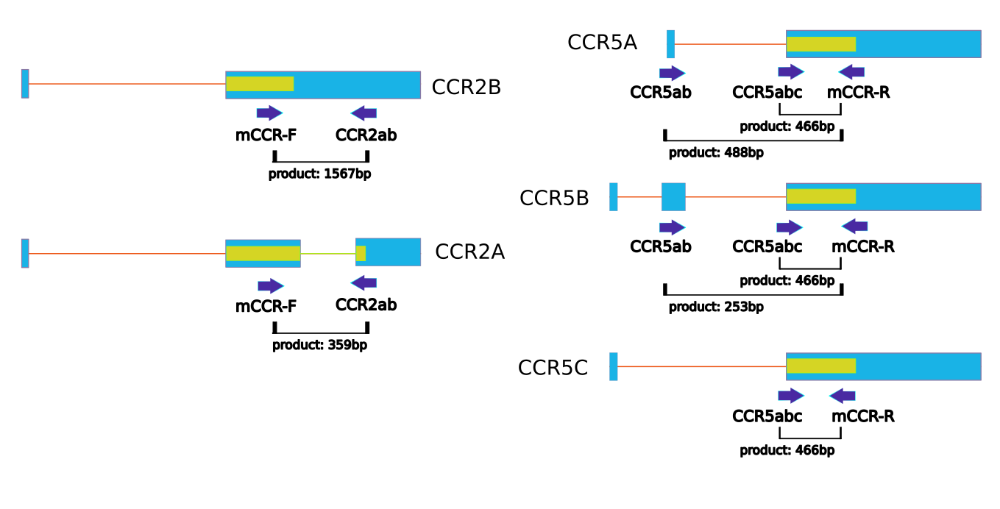
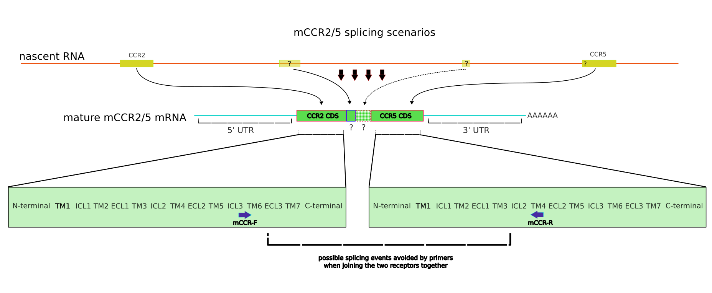
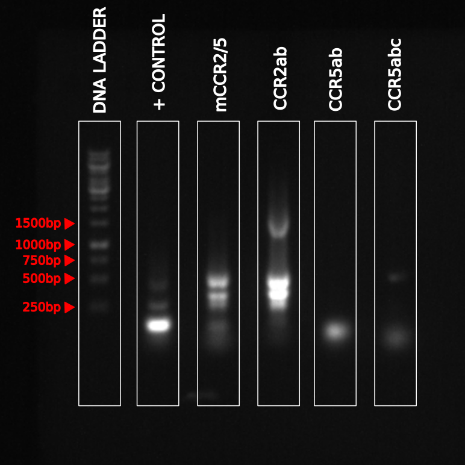
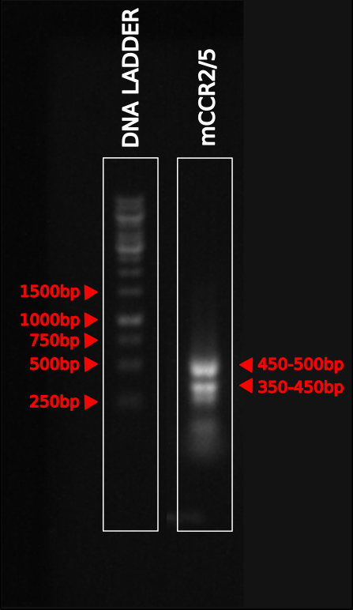
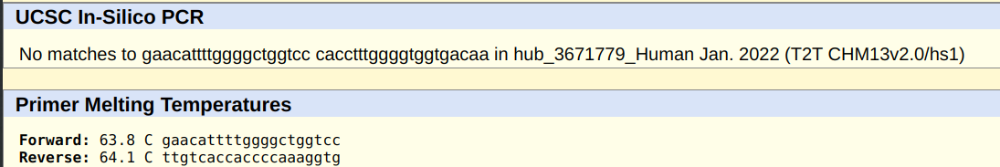

```{r setup, include=FALSE}
knitr::opts_chunk$set(echo = FALSE, warning = FALSE)
options(knitr.kable.NA = "")
```

\pagestyle{fancy}
\widowpenalties 1 10000
\raggedbottom

# Highlights {.unnumbered .unlisted}

* \colorbox{green}{Detected PCR product that suggests transcription and maturation of mCCR2/5 bi-chemokine receptor.}

* Established flow cytometry experiments to see external and internal CCR2 and CCR5 protein expression.

* Collected RNA samples from PBMC, THP-1, LX-2, $M_{0}$ (PMA-induced THP-1 differentiation) cells.

# Current state of the project {.unnumbered .unlisted}

We have previously identified many potential multi-GPCRs with our search pipeline. Among these, there is an interesting case, of CCR2 and CCR5, where the two proteins were previously suggested to interact functionally $in$ $vivo$. Most interestingly, the genetic topology of CCR2 and CCR5 seem to be conserved across many higher vertebrates. CCR2 and CCR5 genes are consistently in close proximity (~10kbp inter-genic distance), and retain same relative orientation, as opposed to other proteins in close proximity. We suspect that the evolutionary pressure to keep the two genes close together while maintaining the same relative orientation might be due to a functional protein product that joins them together as a bi-chemokine receptor.

The aforementioned CCR2 and CCR5 bi-chemokine isoform (referred to as mCCR2/5) was first discovered in a protein database as a hypothetical protein. To support the existence and functionality of this theoretical construct, we have decided to follow up computational work with experimental evidence. Through technical and biological considerations, we decided to set out to discover if human cells transcribe and translate this functional bi-chemokine isoform. This new discovery will show two receptors joined into the same protein chain, through means of alternative splicing.

The first step in the experimental lab has so far been to develop an assay to detect CCR2 and CCR5 in the same transcript. The main method of detection is through polymerase chain reaction (PCR). To accomplish this, two primers were designed targeting CCR2 and CCR5. A sense primer was designed to match the end of the protein coding sequence part of the CCR2 transcript; an antisense primer was designed to match the start of the protein coding sequence part of the CCR5 transcript. Considerations taken into the design process are detailed below. We think that these primers allow detection of a PCR product \underline{only} in the presence of a transcript that has a matching sequence to the end of CCR2 protein coding sequence, and simultaneously having a downstream region matching the start of CCR5 protein coding sequence. We hypothesized that this will be supporting evidence for the transcription and maturation ($i.e.$ alternative splicing and processing) of the mCCR2/5 bi-chemokine protein. With the PCR product detected, the next step is to sequence the product and see the sequence that joins CCR2 to CCR5.


\newpage

\tableofcontents

\newpage

# Discussion

## Prepping for PCR: Primer Design

To detect mCCR2/5 in a PCR reaction, two rounds of primers were designed. They are referred to as old and new primers. Old primers were used to only detect CCR2 and CCR5 expression, and they were used to establish the PCR experimentation. Once we established the expression (through PCR) with the old primers, new primers were designed and used thereon after. New primers were specifically picked to be informative in the expression of CCR2 and CCR5 isoforms, and their bi-chemokine conjugate mCCR2/5. Currently, there are a total of five primers used for this task: mCCR-F, mCCR-R, CCR2ab, CCR5ab, CCR5abc. The table below shows which primer combinations detect which transcripts, and their expected PCR product length. Figure 1 also shows where the primers are placed in all the isoforms of CCR2 and CCR5. 

For example, CCR2 isoforms are detected using a length difference, where the expected PCR product length one isoform is ~1500bp and the other is ~360bp. All isoforms of CCR5 are detected using CCR5abc primer, and CCR5ab primer allows detection of A and B isoform similarly by length difference. CCR5C transcription can only be suggested in the absence of CCR5A and CCR5B signals.

The primers, what they detect, and their expected product lengths are given in the table below:

```{r expectedLength}
coln <-  c("Detected Transcript", "Expected Length", "Sense Primer", "Antisense Primer")
mCCR <-  c("mCCR2/5", "?", "mCCR-F", "mCCR-R")
CCR2A <- c("CCR2A", "359bp", "mCCR-F", "CCR2ab")
CCR2B <- c("CCR2B", "1567bp", "mCCR-F", "CCR2ab")
CCR5A <- c("CCR5A", "488bp", "CCR5ab", "mCCR-R")
CCR5B <- c("CCR5B", "253bp", "CCR5ab", "mCCR-R")
CCR5C <- c("CCR5ABC", "466bp", "CCR5abc", "mCCR-R")

data <- rbind(mCCR, CCR2A, CCR2B, CCR5A, CCR5B, CCR5C)
expData <- data.frame(data)
colnames(expData) <- coln
knitr::kable(expData, row.names = F)
```

```{r CCR2_CCR5_primers, out.height="70%", fig.align="center", fig.cap="Primers that detect all isoforms of CCR2 and CCR5, including the potential bi-chemokine receptor isoform mCCR2/5. Primer locations and directions are shown with a dark blue arrow, with their names underneath. The isoforms of genes are written next to the gene. Thin horizontal orange line represents spliced-out genomic DNA regions, blue boxes refer to mature mRNA sequence, and pale yellow boxes refer to protein coding regions of the genetic sequences. Only blue boxes can be detected with PCR, and the thin lines are spliced out after transcription, during mRNA maturation. The expected lengths of each PCR product is shown under."}

```

\newpage


### Detecting mCCR2/5 with primers

During selection of primers that would detect the bi-chemokine receptor, there were points considered to make the detection as informative and easy as possible (to the best of my ability). The first assumption in this construct is that the coding sequences of both genes must be connected somehow. The splicing event(s) that join the two genes, although, remain unknown, and making assumptions would be speculative. Some ideas were considered, mainly the hypothesis that suspects the splicing to add in, or remove odd numbers of transmembrane helices (parsimoniously a single helix) to alleviate the orientation problem, where without a solution one of the receptors insert into the membrane in an inverted fashion, neither interacting with ligands nor G-proteins. With this in mind, primers were not put on the edges of the protein coding regions, and were set rather further away from terminal regions.

The figure below shows where the primers target in the sequences with the subdomains of the proteins denoted, and how the splicing process is imagined to join both receptors into a single transcript through splicing event(s).

```{r primer_design_closeup, out.height="50%", fig.align="center", fig.cap="Maturation scenarios of mCCR2/5. First row is the nascent RNA, transcribed directly from the genome, and the second row is the hypothetical mCCR2/5 mature mRNA. Since the splicing event to join the new two proteins together can incorporate new elements, or remove existing elements from the coding sequences of CCR2 or CCR5, the primers were designed to complement functional parts of the receptors, hypothesizing that these parts are the most unlikely to be spliced out."}

```

\quad

The primers target the protein coding sequence regions, and considering there might be helix introductions, or helix removals, the primers were designed to target the sixth helix in CCR2 (residues 206-213), and the fourth helix in CCR5 (residues 142-149). The sense primer is set before the isoform difference of CCR2 (CCR2A and CCR2B differ in their protein coding sequence, while CCR5 isoforms all have the same protein sequence). The reverse primer was set further back on CCR5 because there is literature suggestion that CCR5 can retain its native functionality without its first 2 helices; while the last helices of GPCRs are crucial for activity because they contain important functional motifs. Given these two regions, the PCR product, if produced, could be informative based on the length of the product, where the expected size is the distance between two primers if the two proteins were added side-by-side. If it is about the expected size, then the splicing could be joining the two genes back to back without any editing; if it is longer than expected, there could be elements added from the inter-genic region; and if it is shorter than expected, there should be elements removed from either (or both) of the proteins.


\newpage


## PCR results

Using the primers from the above section, PCR was performed to detect transcribed genes in extracted RNA from THP-1 cells.

```{r PCR_base, out.height="50%", fig.align="center", fig.cap="PCR results from THP-1 cDNA, detecting CCR2 with its isoforms, CCR5 with its isoforms, and mCCR2/5. Left-most lane is the DNA ladder, and indicates the length of PCR products run on gel."}

```

### Expression of CCR2 and CCR5

As the designed primers can detect all isoforms of CCR2 (CCR2A, CCR2B) and CCR5 (CCR5A, CCR5B, CCR5C), the PCR results can be interpreted in a way to understand all the expressed isoforms of both CCR2 and CCR5. The first, and second lanes represent the DNA ladder and positive control, respectively.

In the fourth ladder in Figure 1, titled CCR2ab, there are two expected lengths: ~360bp for CCR2A, ~1600bp for CCR2B. As we can see from the gel, the dominant isoform that is expressed in the cell is CCR2A, the long isoform of CCR2 (longer protein, shorter mature mRNA). It is also visible that there is minor expression of CCR2B, the short isoform (shorter protein, longer mature mRNA). The two isoforms can be seen in Figure 3.

In the fifth and sixth lane in Figure 1, titled CCR5ab and CCR5abc, there are three different isoform options. CCR5abc was designed to detect any isoforms of CCR5, and CCR5ab detects only the A and the B isoforms, which can then be distinguished by their lengths. Looking at the gel, the results suggest that CCR5A is not expressed, and CCR5B is expressed in low concentrations. CCR5B band (at 253bp) could be missing and the signal could be coming from only the primers. There seems to be very low expression in the sixth lane around 466bp, and this could be representing some expression of CCR5. The low expression seen here also agrees with the flow cytometry and PCR data from previous experiments on THP-1 cell line.


### Expression of mCCR2/5

In the figure below, we focus on the length of the PCR product of the potential bi-chemokine CCR2-CCR5 protein. Assuming a splicing event happening to join these two genes together, the coding sequence of two genes should be connected. 

The resulting 450-500bp band and 350-450bp band, if not detecting some irrelevant element, could be representing two different isoforms of mCCR2/5. 

```{r PCR_focus, out.height="50%", fig.align="center", fig.cap="PCR results from THP-1 RNA extract, highlighting only the DNA ladder and mCCR2/5 lane from previous figure."}

```

As discussed above in the "Detecting mCCR2/5 with primers" section, the length of the PCR product could be a sneak peek into the splicing event(s) that join the two chemokine receptors into a functional new receptor. Firstly, the expected length of mCCR2/5 when two proteins are just spliced in together without any sequence addition or removal is 911bps. Since the two bands represent a shorter product, there should be splicing that cuts out some of the protein sequence of CCR2 or CCR5, or both. Below are sequence tables, where primer-targeting regions are highlighted in red. In the hypothetical unedited box, different colors indicate where coding sequence for CCR2 ends and the coding sequence for CCR5 begins, showing the expected PCR product if no element was spliced in/out.

\noindent\fbox{%
    \parbox{\textwidth}{%
        CCR2 protein coding sequence: \seqsplit{ATGCTGTCCACATCTCGTTCTCGGTTTATCAGAAATACCAACGAGAGCGGTGAAGAAGTCACCACCTTTTTTGATTATGATTACGGTGCTCCCTGTCATAAATTTGACGTGAAGCAAATTGGGGCCCAACTCCTGCCTCCGCTCTACTCGCTGGTGTTCATCTTTGGTTTTGTGGGCAACATGCTGGTCGTCCTCATCTTAATAAACTGCAAAAAGCTGAAGTGCTTGACTGACATTTACCTGCTCAACCTGGCCATCTCTGATCTGCTTTTTCTTATTACTCTCCCATTGTGGGCTCACTCTGCTGCAAATGAGTGGGTCTTTGGGAATGCAATGTGCAAATTATTCACAGGGCTGTATCACATCGGTTATTTTGGCGGAATCTTCTTCATCATCCTCCTGACAATCGATAGATACCTGGCTATTGTCCATGCTGTGTTTGCTTTAAAAGCCAGGACGGTCACCTTTGGGGTGGTGACAAGTGTGATCACCTGGTTGGTGGCTGTGTTTGCTTCTGTCCCAGGAATCATCTTTACTAAATGCCAGAAAGAAGATTCTGTTTATGTCTGTGGCCCTTATTTTCCACGAGGATGGAATAATTTCCACACAATAATGAG}\textcolor{red}{GAACATTTTGGGGCTGGTCC}\seqsplit{TGCCGCTGCTCATCATGGTCATCTGCTACTCGGGAATCCTGAAAACCCTGCTTCGGTGTCGAAACGAGAAGAAGAGGCATAGGGCAGTGAGAGTCATCTTCACCATCATGATTGTTTACTTTCTCTTCTGGACTCCCTATAATATTGTCATTCTCCTGAACACCTTCCAGGAATTCTTCGGCCTGAGTAACTGTGAAAGCACCAGTCAACTGGACCAAGCCACGCAGGTGACAGAGACTCTTGGGATGACTCACTGCTGCATCAATCCCATCATCTATGCCTTCGTTGGGGAGAAGTTCAGAAGGTATCTCTCGGTGTTCTTCCGAAAGCACATCACCAAGCGCTTCTGCAAACAATGTCCAGTTTTCTACAGGGAGACAGTGGATGGAGTGACTTCAACAAACACGCCTTCCACTGGGGAGCAGGAAGTCTCGGCTGGTTTATAA}
    }%
}

\noindent\fbox{%
    \parbox{\textwidth}{%
        CCR5 protein coding sequence: \seqsplit{ATGGATTATCAAGTGTCAAGTCCAATCTATGACATCAATTATTATACATCGGAGCCCTGCCAAAAAATCAATGTGAAGCAAATCGCAGCCCGCCTCCTGCCTCCGCTCTACTCACTGGTGTTCATCTTTGGTTTTGTGGGCAACATGCTGGTCATCCTCATCCTGATAAACTGCAAAAGGCTGAAGAGCATGACTGACATCTACCTGCTCAACCTGGCCATCTCTGACCTGTTTTTCCTTCTTACTGTCCCCTTCTGGGCTCACTATGCTGCCGCCCAGTGGGACTTTGGAAATACAATGTGTCAACTCTTGACAGGGCTCTATTTTATAGGCTTCTTCTCTGGAATCTTCTTCATCATCCTCCTGACAATCGATAGGTACCTGGCTGTCGTCCATGCTGTGTTTGCTTTAAAAGCCAGGACGGT}\textcolor{red}{CACCTTTGGGGTGGTGACAA}\seqsplit{GTGTGATCACTTGGGTGGTGGCTGTGTTTGCGTCTCTCCCAGGAATCATCTTTACCAGATCTCAAAAAGAAGGTCTTCATTACACCTGCAGCTCTCATTTTCCATACAGTCAGTATCAATTCTGGAAGAATTTCCAGACATTAAAGATAGTCATCTTGGGGCTGGTCCTGCCGCTGCTTGTCATGGTCATCTGCTACTCGGGAATCCTAAAAACTCTGCTTCGGTGTCGAAATGAGAAGAAGAGGCACAGGGCTGTGAGGCTTATCTTCACCATCATGATTGTTTATTTTCTCTTCTGGGCTCCCTACAACATTGTCCTTCTCCTGAACACCTTCCAGGAATTCTTTGGCCTGAATAATTGCAGTAGCTCTAACAGGTTGGACCAAGCTATGCAGGTGACAGAGACTCTTGGGATGACGCACTGCTGCATCAACCCCATCATCTATGCCTTTGTCGGGGAGAAGTTCAGAAACTACCTCTTAGTCTTCTTCCAAAAGCACATTGCCAAACGCTTCTGCAAATGCTGTTCTATTTTCCAGCAAGAGGCTCCCGAGCGAGCAAGCTCAGTTTACACCCGATCCACTGGGGAGCAGGAAATATCTGTGGGCTTGTGA}
    }%
}

\noindent\fbox{%
    \parbox{\textwidth}{%
        Unedited hypothetical PCR product of mCCR2/5: \textcolor{red}{GAACATTTTGGGGCTGGTCC}\textcolor{teal}{\seqsplit{TGCCGCTGCTCATCATGGTCATCTGCTACTCGGGAATCCTGAAAACCCTGCTTCGGTGTCGAAACGAGAAGAAGAGGCATAGGGCAGTGAGAGTCATCTTCACCATCATGATTGTTTACTTTCTCTTCTGGACTCCCTATAATATTGTCATTCTCCTGAACACCTTCCAGGAATTCTTCGGCCTGAGTAACTGTGAAAGCACCAGTCAACTGGACCAAGCCACGCAGGTGACAGAGACTCTTGGGATGACTCACTGCTGCATCAATCCCATCATCTATGCCTTCGTTGGGGAGAAGTTCAGAAGGTATCTCTCGGTGTTCTTCCGAAAGCACATCACCAAGCGCTTCTGCAAACAATGTCCAGTTTTCTACAGGGAGACAGTGGATGGAGTGACTTCAACAAACACGCCTTCCACTGGGGAGCAGGAAGTCTCGGCTGGTTTATAA}}\textcolor{orange}{\seqsplit{ATGGATTATCAAGTGTCAAGTCCAATCTATGACATCAATTATTATACATCGGAGCCCTGCCAAAAAATCAATGTGAAGCAAATCGCAGCCCGCCTCCTGCCTCCGCTCTACTCACTGGTGTTCATCTTTGGTTTTGTGGGCAACATGCTGGTCATCCTCATCCTGATAAACTGCAAAAGGCTGAAGAGCATGACTGACATCTACCTGCTCAACCTGGCCATCTCTGACCTGTTTTTCCTTCTTACTGTCCCCTTCTGGGCTCACTATGCTGCCGCCCAGTGGGACTTTGGAAATACAATGTGTCAACTCTTGACAGGGCTCTATTTTATAGGCTTCTTCTCTGGAATCTTCTTCATCATCCTCCTGACAATCGATAGGTACCTGGCTGTCGTCCATGCTGTGTTTGCTTTAAAAGCCAGGACGGT}}\textcolor{red}{CACCTTTGGGGTGGTGACAA}
    }%
}

\noindent\fbox{%
    \parbox{\textwidth}{%
        Possible PCR product of mCCR2/5 after splicing: \textcolor{red}{GAACATTTTGGGGCTGGTCC}\textcolor{violet}{\seqsplit{TGCCGCTGCTCATCATGGTCATCTGCTACTCGGGAATCCTGAAAACCCTGCTTCGGTGTCGAAACGAGAAGAAGAGGCATAGGGCAGTGAGAGTCATCTTCACCATCATGATTGTTTACTTTCTCTTCTGGACTCCCTATAATATTGTCATTCTCCTGAACACCTTCCAGGAATTCTTCGGCCTGAGTAACTGTGAAAGCACCAGTCAACTGGACCAAGCCACGCAGGTGACAGAGACTCTTGGGATGACTCACTGCTGCATCAATCCCATCATCTATGCCTTCGT}}\textcolor{lightgray}{\seqsplit{TGGGGAGAAGTTCAGAAGGTATCTCTCGGTGTTCTTCCGAAAGCACATCACCAAGCGCTTCTGCAAACAATGTCCAGTTTTCTACAGGGAGACAGTGGATGGAGTGACTTCAACAAACACGCCTTCCACTGGGGAGCAGGAAGTCTCGGCTGGTTTATAAATGGATTATCAAGTGTCAAGTCCAATCTATGACATCAATTATTATACATCGGAGCCCTGCCAAAAAATCAATGTGAAGCAAATCGCAGCCCGCCTCCTGCCTCCGCTCTACTCACTGGTGTTCATCTTTGGTTTTGTGGGCAACATGCTGGTCATCCTCATCCTGATAAA}}\textcolor{violet}{\seqsplit{CTGCAAAAGGCTGAAGAGCATGACTGACATCTACCTGCTCAACCTGGCCATCTCTGACCTGTTTTTCCTTCTTACTGTCCCCTTCTGGGCTCACTATGCTGCCGCCCAGTGGGACTTTGGAAATACAATGTGTCAACTCTTGACAGGGCTCTATTTTATAGGCTTCTTCTCTGGAATCTTCTTCATCATCCTCCTGACAATCGATAGGTACCTGGCTGTCGTCCATGCTGTGTTTGCTTTAAAAGCCAGGACGGT}}\textcolor{red}{CACCTTTGGGGTGGTGACAA}
    }%
}


I speculate here that, since the TM helices further down ($i.e.$ 5, 6, 7) contain more functional motifs, the removed region should be until the second helix of CCR5. 

Joining the two receptors together, while splicing out the C-terminal of CCR2, the N-terminal and first helix of CCR5 roughly results in a PCR product of 581bps. The sequence is highlighted in the last sequence box above, where the removed region is highlighted in light gray. This would also alleviate the previously mentioned orientation problem.

Putting aside the speculative scenarios, the PCR gel shows promising results that suggest monocytes express this bi-chemokine receptor, possibly leveraging the suggested increased sensitivity of the natively dimerizing CCR2-CCR5 receptors. This is also confirmed by UCSC in-silico primer design, where the primers for mCCR2/5 should not be detecting any transcript from the human genome (Figure 5). To confirm this, it is best to sequence the PCR product and approve the results of the PCR gel.

```{r UCSCinsilico, out.height="50%", fig.align="center", fig.cap="Result from UCSC in-silico primer design tool. It shows that the forward and sense primer have no (off) targets, and can only detect this bi-chemokine construct."}

```


\newpage

# Detailed Monthly Summary

## September

Primer pairs were initially designed to establish the methodical outline for the experiments. Only CCR2 and CCR5 were tried to be detected. When these confirmed expression of CCR2 and CCR5, new primers were designed that allow more conclusions to be withdrawn from a single PCR result. To make the switch from old primers to new primers smooth, first assays were done with all of the primers (old and new), where the old primers had pre-established expected results.

### 19.09.23 {.unnumbered .unlisted}

cDNA synthesized from LX-2 extracted RNA.

### 19.09.23 {.unnumbered .unlisted}

PCR results were run on gel, and RNA was extracted from LX-2 cells. 

### 11.09.23 {.unnumbered .unlisted}

cDNA was synthesized from $M_{0}$ and THP-1 RNA. New primers arrived for mCCR2/5 detection, as well as CCR2, CCR5 isoform detection. PCR was done with new and old primers, to transition completely to new ones.

### 07.09.23 {.unnumbered .unlisted}

Macrophage RNA was extracted after differentiation (48h). Flow cytometry was repeated on $M_{0}$ cells to see expression of CCR2 and CCR5 on cell surface. CCR2 was expressed, and there was no signal for CCR5 expression.

LPS/$interferon_{\gamma}$ differentiation can be done to look at CCR5 expression. LX-2 cells can be tested for both CCR2 and CCR5 expression by flow cytometry, as they are expected to express both of them on the cell surface.

### 05.09.23 {.unnumbered .unlisted}

Macrophage $M_{0}$ differentiation was induced using PMA.

### 04.09.23 {.unnumbered .unlisted}

THP-1 RNA was converted again to cDNA as it was finished form previous PCR experiments.

## August

Experiments were started to establish a workflow that focuses on clear, reproducible, and interpretable results. Month of August was spent on starting out with cell culture and maintenance, RNA extraction, cDNA synthesis, PCR amplification, gel electrophoresis, and flow cytometry.

### 27.08.23 {.unnumbered .unlisted}

PCR was repeated with more cDNA ($4{\mu}L$ instead of $2{\mu}L$ cDNA) to see the expression of CCR2 and CCR5. The bands in gel were more clear.

### 09.08.23 {.unnumbered .unlisted}

Flow cytometry experiment was repeated on THP-1 cell line, including internal staining. CD14+ cells were also used to see CCR2 and CCR5 cell surface expression. CD14+ cells didn't have signal for CCR2 nor CCR5, but this might have been due to technical errors (cells might have been dead during preparation process). THP-1 cells had CCR2 in internal and external experiments, but CCR5 signal was not apparent in either case.

### 08.08.23 {.unnumbered .unlisted}

Ordered primers arrived. Primer stocks were prepared to $50{\mu}M$ concentration. First PCR was done with THP-1 cDNA to detect the transcription of CCR2, and CCR5. Gel electrophoresis was done for the first time. Both receptor transcripts were detected, but at relatively low levels compared to the positive control (EEF2). Compared to CCR2 expression, CCR5 signal was detected less.

### 06.08.23 {.unnumbered .unlisted}

First flow cytometry experiment was performed. Cells were counted, stained for CCR2 and CCR5 antibodies with isotype control. There was signal detected for CCR2 expression on the cell surface, but CCR5 signal was not present (or negligibly low).

### 02.08.23 {.unnumbered .unlisted}

Extracted RNA from THP-1 cells were converted to cDNA using RT PCR reaction.

## July

### 31.07.23 {.unnumbered .unlisted}

First look at THP-1 cell line, culture conditions and maintenance. Morphology of dead and alive cells were compared. Cell passage was done. RNA was extracted from THP-1 cells. Started on primer design to only detect CCR2 and CCR5. 


